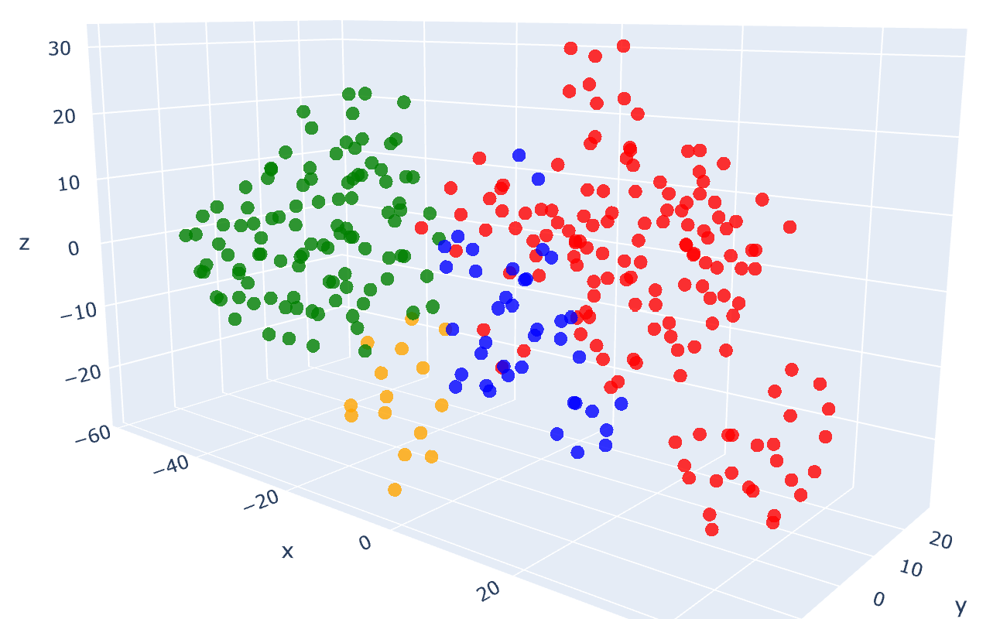
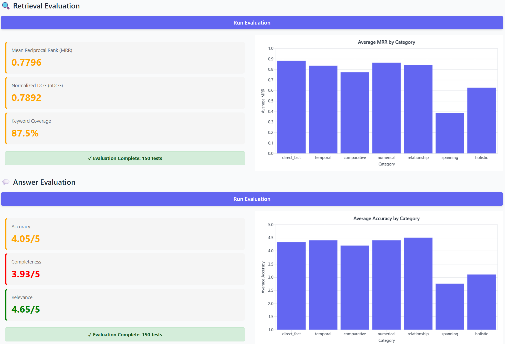
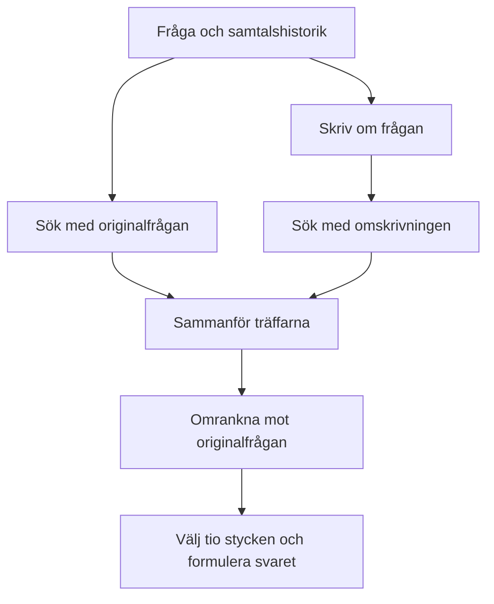
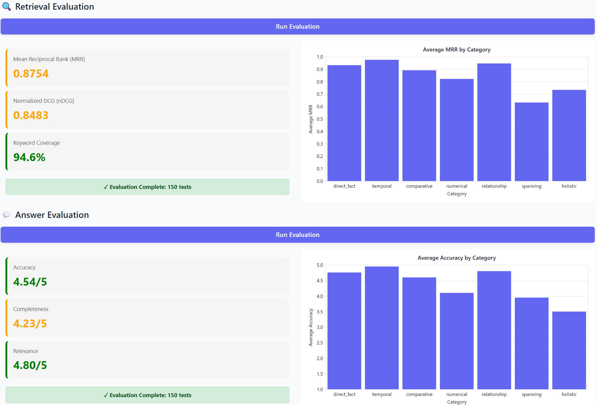

# Hur hittar din AI-assistent rätt bland alla dokument?

Du vill ansöka om semester, men en vanlig intranätssökning på ”semesteransökan” ger en röra av gamla nyheter, manualer och rutiner.

Med en intern AI-assistent borde det räcka att ställa frågan:

**Hur ansöker jag om semester, och vem godkänner den?**

Men att få en språkmodell att läsa och sammanfatta rätt utdrag – det som kallas **RAG** – är svårare än det ser ut, särskilt när svaret måste pusslas ihop från flera olika dokument. Här kikar vi under huven på hur tekniken fungerar, var den fallerar och hur den kan trimmas.

I den här artikeln, som bygger på Ed Donners kurs i LLM Engineering, följer vi hela kedjan: från enkel ordmatchning till sökning med embeddings, utvärdering och en mer avancerad RAG-lösning. Exemplen utgår från en fiktiv svensk personalhandbok. Resultaten kommer från mina körningar på labbens 150 testfrågor.

Jag har lagt kod och metod som utfällbara fördjupningar. Huvudtexten går att läsa utan att öppna dem.

## Innehåll

- [Ge modellen något att läsa](#ge-modellen-något-att-läsa)
- [Första försöket: leta efter rätt ord](#första-försöket-leta-efter-rätt-ord)
- [När text blir punkter i ett rum](#när-text-blir-punkter-i-ett-rum)
- [Hur stor ska en bit kunskap vara?](#hur-stor-ska-en-bit-kunskap-vara)
- [Från sökträff till färdigt svar](#från-sökträff-till-färdigt-svar)
- [Hur man kan testa och utvärdera RAG](#hur-man-kan-testa-och-utvärdera-rag)
- [Vårt första testresultat: var uppstår problemen?](#vårt-första-testresultat-var-uppstår-problemen)
- [En mer avancerad version: förbättra vägen till svaret](#en-mer-avancerad-version-förbättra-vägen-till-svaret)
- [Resultatet: bättre totalt, men inte på allt](#resultatet-bättre-totalt-men-inte-på-allt)
- [Vad det innebär att assistenten kan dokumenten](#vad-det-innebär-att-assistenten-kan-dokumenten)
- [Kod och notebooks](#kod-och-notebooks)

---


## Ge modellen något att läsa

En språkmodell vet mycket om semester i allmänhet, men den känner inte automatiskt till vår arbetsplats, vårt personalsystem eller våra rutiner. Utan rätt underlag kan svaret låta övertygande men vara helt oanvändbart för den som ska skicka in sin ansökan.

Här kommer RAG, *Retrieval-Augmented Generation*, in. Först söker systemet efter relevant information. Sedan får språkmodellen läsa de utvalda textstyckena tillsammans med frågan och formulera ett svar.

I vår fiktiva personalhandbok finns tre dokument som kan bidra till rätt svar:


| Dokument              | Information                                                               |
| --------------------- | ------------------------------------------------------------------------- |
| `semester.md`         | Semesteransökan registreras i Personalportalen.                           |
| `personalportalen.md` | Välj **Ledighet → Semester**, ange datum och skicka ansökan.              |
| `godkannande.md`      | Närmaste chef godkänner semesteransökan. Status visas i Personalportalen. |


Modellen i sig behöver inte tränas om. Vi ger den bara ett underlag att använda just när den ska svara. Ändras rutinen kan dokumenten och sökindexet uppdateras.

Men varför inte skicka med hela handboken varje gång? För ett litet material är det fullt rimligt. I ett större material innebär det däremot att modellen får enorma mängder text att gå igenom för varje enskild fråga. Det slukar tokens i onödan, särskilt när svaret ryms i några få meningar. RAG gör ett urval innan svaret skrivs. Därmed blir själva **urvalet avgörande för svaret**.

## Första försöket: leta efter rätt ord

Den första lösningen är nästan förvånande enkel. Vi samlar dokument i ett Python-uppslag och letar efter ord i frågan som matchar nycklarna.

```python
kunskap = {
    "semester": "Semesteransökan registreras i Personalportalen.",
    "godkänner": (
        "Närmaste chef godkänner semesteransökan. "
        "Status visas i Personalportalen."
    ),
}

def hamta_kontext(fraga):
    text = "".join(c for c in fraga if c.isalpha() or c.isspace())
    return [kunskap[ordet] for ordet in text.lower().split()
            if ordet in kunskap]
```

Frågan innehåller både *semester* och *godkänner*, så vi får två träffar:

```text
Semesteransökan registreras i Personalportalen.
Närmaste chef godkänner semesteransökan. Status visas i Personalportalen.
```

Det räcker för delar av svaret. Men om användaren skriver **”Hur söker jag ledigt i sommar?”** får just den här funktionen inga träffar. Orden matchar inte nycklarna. Instruktionen om vilka menyval som behövs ligger dessutom utanför vårt lilla uppslag.

Vi behöver ett sätt att hitta rätt innehåll även när formuleringarna skiljer sig åt.

## När text blir punkter i ett rum

En **embeddingmodell** omvandlar text till en vektor: en lista med tal. Modellen har tränats så att representationerna kan fånga bland annat likheter i innehåll. Det gör det möjligt att söka efter närbesläktade texter utan att kräva exakt samma ord.

Tänk på formuleringarna *”söka ledigt i sommar”* och *”registrera en semesteransökan”*. De ser olika ut som teckensträngar, men handlar om närliggande saker. Med en användbar representation kan de hamna nära varandra i vektorrummet.

I det första experimentet delades 76 dokument upp i 413 textstycken (chunks). Vi använder här `text-embedding-3-small`, en embeddingmodell från OpenAI. Den gav varje stycke en vektor med **1 536 dimensioner**. 

```text
Loaded 76 documents
Divided into 413 chunks
There are 413 vectors with 1,536 dimensions in the vector store
```

Det är svårt att föreställa sig 1 536 dimensioner. För att göra dem synliga använder vi **t-SNE**, en matematisk metod som komprimerar tusentals dimensioner till **tre dimensioner** som kan visualiseras på en karta.



*Varje punkt är ett textstycke. Grönt visar personaldokument, blått produkter, rött avtal och orange företagsinformation. Färgerna kommer från dokumentkategorierna; placeringen beräknas ur vektorerna. Närliggande grupper gör likheter mellan textstycken synliga.*

Personalmaterialet samlas tydligt på ena sidan, medan produkt- och avtalsmaterial ligger närmare varandra på flera ställen. Det är begripligt: ett avtal kan beskriva samma produkt och egenskaper som produktinformationen. Kategorierna är olika, men innehållet kan överlappa.

Kom ihåg att bilden är en förenklad karta över vektorerna där många dimensioner har komprimerats till få. Sökningen sker dock i det ursprungliga vektorrummet, inte i 3D-bilden.

<details>
<summary><strong>Teknisk fördjupning: Skapa vektorer och söka i databasen</strong></summary>

När användaren frågar om semester omvandlas även frågan till en vektor med samma embeddingmodell. 

Vektordatabasen **Chroma** jämför den med lagrade vektorer och returnerar närliggande textstycken. Tillsammans med vektorerna finns själva texten och metadata, exempelvis vilken fil den kommer från.

Vi har alltså två olika modelluppgifter: embeddingmodellen skapar representationer för sökningen, medan språkmodellen senare läser underlaget och formulerar svaret. Sökningen kan uttryckas så här:

```python
from openai import OpenAI

client = OpenAI()
fraga = "Hur ansöker jag om semester, och vem godkänner den?"

# Skapa vektor för frågan med samma modell som indexerade dokumenten
fraga_vektor = client.embeddings.create(
    model="text-embedding-3-small",
    input=[fraga],
).data[0].embedding

# Sök fram de 5 närmaste textstyckena i Chroma
traffar = collection.query(
    query_embeddings=[fraga_vektor],
    n_results=5,
)
```

`embedding_model` måste här motsvara modellen som användes när dokumenten indexerades. Två olika modeller kan organisera vektorrummet på olika sätt, även om deras vektorer råkar vara lika långa. Därför kräver ett modellbyte normalt att dokumentens embeddings skapas på nytt.

För visualiseringen används ett separat steg:

```python
from sklearn.manifold import TSNE

# Reducerar vektorerna till 3 dimensioner för att kunna ritas som en graf
punkter_3d = TSNE(n_components=3, random_state=42).fit_transform(vektorer)
```

t-SNE försöker bevara lokala grannskap. Axlarna har ingen bestämd ämnesbetydelse, och avstånd mellan grupper ska inte läsas som exakta mått på likhet i texten.

</details>

## Hur stor ska en bit kunskap vara?

Varför dela upp dokumenten över huvud taget? En personalhandbok kan handla om semester, löner, friskvård och arbetsmiljö. En enda vektor för hela texten behöver representera allt detta. Ett kortare avsnitt om semester kan bli en mer träffsäker sökkandidat för vår fråga.

Men uppdelningen kan också gå för långt. Tänk om `godkannande.md` delas vid meningsgränsen:

```text
Stycke 1: Närmaste chef godkänner semesteransökan.
Stycke 2: Status visas i Personalportalen.
```

Båda meningarna är begripliga var för sig. Ändå uppstår ett problem om någon frågar: *”Vem godkänner min semesteransökan, och var ser jag om den blivit godkänd?”* Om sökningen bara hämtar stycke 1 får assistenten svar på första halvan av frågan, men saknar uppgiften om status.

Behålls meningarna tillsammans får modellen ett mer användbart underlag:

```text
Källa: godkannande.md
Närmaste chef godkänner semesteransökan.
Status visas i Personalportalen.
```

Men en alltför stor textbit skapar ett annat problem. Om samma sökträff också innehåller flera sidor om lön och friskvård blir semesterinformationen en liten del av det som vektorn ska representera. **Chunking handlar om balansen: tillräckligt litet för att bli en tydlig sökträff, men tillräckligt stort för att behålla sammanhanget som behövs för svaret.** Ett vanligt sätt är att dela vid naturliga brytpunkter och låta texten överlappa mellan styckena.

<details>
<summary><strong>Teknisk fördjupning: Textuppdelning och försöksinställningar</strong></summary>

Notebooken använder `RecursiveCharacterTextSplitter`, som söker brytpunkter vid bland annat styckegränser och mellanslag:

```python
from langchain_text_splitters import RecursiveCharacterTextSplitter

text_splitter = RecursiveCharacterTextSplitter(
    chunk_size=1000,  # Max 1000 tecken per stycke
    chunk_overlap=200,  # Överlapp upp till 200 tecken
)
chunks = text_splitter.split_documents(documents)
```

Här avser storleken **tecken**, inte tokens. Överlappet gör att en del text kan följa med till nästa stycke. Det minskar risken att information försvinner precis vid gränsen, men garanterar inte att alla nödvändiga samband bevaras.

Även **antalet hämtade stycken** spelar roll. Storlek och antal avgör tillsammans hur mycket text svarsmodellen får läsa och behöver därför vägas mot varandra. 

</details>

## Från sökträff till färdigt svar

Nu har vi textstycken som kan besvara semesterfrågan. Nästa steg är att lägga dem i modellens kontext tillsammans med en instruktion och själva frågan.


| Användarens dialog                                                                                                                                                                                                                      | Underlag som sökningen hittade                                                                                                                                                                                                            |
| --------------------------------------------------------------------------------------------------------------------------------------------------------------------------------------------------------------------------------------- | ----------------------------------------------------------------------------------------------------------------------------------------------------------------------------------------------------------------------------------------- |
| **Fråga:** Hur ansöker jag om semester, och vem godkänner den?<br><br>**Svar:** Du ansöker i Personalportalen under Ledighet → Semester. Ange datum och skicka ansökan. Din närmaste chef godkänner den, och du kan följa statusen i portalen. | `semester.md` Semesteransökan registreras i Personalportalen. <br><br>`personalportalen.md` Välj Ledighet → Semester, ange datum och skicka ansökan. <br><br>`godkannande.md` Närmaste chef godkänner semesteransökan. Status visas i Personalportalen. |


Nu går det att följa varje del av svaret tillbaka till ett utdrag. Det visar också varför en fråga kan vara svårare än den låter: **var** man ansöker, **hur** man gör det och **vem** som godkänner framgår av olika dokument. Om sökningen missar ett av dem kan svaret bli välformulerat men ofullständigt. Frågor som kräver flera sådana informationsdelar kallas *spanning* i utvärderingen.

Men tänk om frågan i stället är: **”Hur många dagar i förväg måste jag ansöka?”** Inget av de tre utdragen anger någon tidsgräns. Då är ett bra svar: *”Jag hittar ingen uppgift om det i de här dokumenten.”* Att använda dokument som underlag innebär också att låta bli att fylla i sådant som saknas.

Källnamnen gör det möjligt att granska svaret. De garanterar inte i sig att varje påstående stöds av texten; det behöver vi kontrollera genom att jämföra dem.

<details>
<summary><strong>Teknisk fördjupning: Svarsfunktionen med promptmall</strong></summary>

En förenklad version av svarsfunktionen visar hela grundprincipen:

```python
def svara(fraga):
    # 1. Hämta relevanta dokumentstycken
    dokument = retriever.invoke(fraga)

    # 2. Sammanställ texten med källangivelser
    kontext = "\n\n".join(
        f"Källa: {doc.metadata['source']}\n{doc.page_content}"
        for doc in dokument
    )

    # 3. Formulera systeminstruktionen
    instruktion = (
        "Besvara frågan enbart baserat på dokumentutdragen. "
        "Om underlaget inte räcker, säg vad som saknas.\n\n"
        f"Underlag:\n{kontext}"
    )

    # 4. Generera svaret
    svar = llm.invoke([
        {"role": "system", "content": instruktion},
        {"role": "user", "content": fraga},
    ])
    return svar.content
```

Modellen får vanlig text att läsa. Vektorerna har redan gjort sitt arbete i sökningen. 

</details>

## Hur man kan testa och utvärdera RAG

Ett lyckat svar på semesterfrågan visar att systemet *kan* fungera. Det säger mindre om hur ofta det fungerar, eller vilka frågor det misslyckas med. För att jämföra två versioner behövs därför **fasta testfrågor med referenssvar och förväntade sökord**.

Labbens testunderlag innehåller **150 frågor** i olika kategorier: direkta faktafrågor, tidsfrågor, jämförelser, numeriska frågor, relationer, frågor som kräver flera informationsdelar och frågor om helheten. Här är några exempel:


| Typ          | Fråga                                               | Förväntat svar och sökord                                                                                                                                                    |
| ------------ | --------------------------------------------------- | ---------------------------------------------------------------------------------------------------------------------------------------------------------------------------- |
| Direkt fakta | Var registrerar jag min semesteransökan?            | I Personalportalen. Sökord: `Personalportalen`.                                                                                                                              |
| Relation     | Vem godkänner semesteransökan?                      | Närmaste chef. Sökord: `närmaste chef`.                                                                                                                                      |
| Spanning     | Hur ansöker jag om semester, och vem godkänner den? | Registrera ansökan i Personalportalen, välj Ledighet → Semester, ange datum och skicka in. Närmaste chef godkänner. Sökord: `Personalportalen`, `Semester`, `närmaste chef`. |


Skillnaden mellan kategorierna är användbar: en lösning kan bli bättre på enkla faktafrågor och samtidigt missa frågor som kräver att flera källor hittas. Ett testunderlag gör det möjligt att se *vilken sorts fel* en förändring påverkar.

<details>
<summary><strong>Teknisk fördjupning: Testfall, sökmått och svarbedömning</strong></summary>

Ett pedagogiskt testfall med semesterexemplet kan skrivas så här:

```python
testfall = {
    "question": "Hur ansöker jag om semester, och vem godkänner den?",
    "keywords": ["Personalportalen", "Semester", "närmaste chef"],
    "reference_answer": (
        "Du ansöker i Personalportalen under Ledighet → Semester. "
        "Ange datum och skicka ansökan. Din närmaste chef godkänner "
        "den, och du kan följa statusen i portalen."
    ),
    "category": "spanning",
}
```

Kodnamnen för kategorierna är `direct_fact`, `temporal`, `comparative`, `numerical`, `relationship`, `spanning` och `holistic`. Frågorna är fördelade över kategorierna: 70 direkta faktafrågor, 20 tidsfrågor, 20 flerkällsfrågor och tio av vardera övrig kategori.

**MRR** (*Mean Reciprocal Rank*) beräknas här per nyckelord. Första förekomsten på plats 1 ger 1/1 = 1, på plats 3 ger den 1/3 ≈ 0,33, och ett missat ord ger 0. Genomsnittet över sökorden blir frågans poäng. Sökningen sker i styckenas text, inte deras filnamn.

**nDCG** (*Normalized Discounted Cumulative Gain*) tar även hänsyn till fler träffar för varje nyckelord och ger högre vikt åt tidiga placeringar. Labbens kod jämför med bästa möjliga ordning för de stycken som faktiskt hämtades. Nyckelordens närvaro är en sökindikator, inte ett bevis på att underlaget besvarar frågan.

Svarbedömaren använder också GPT-4.1 Nano, i ett separat anrop. Den jämför med referenssvaret utan att få de hämtade utdragen. Betygen mäter därför inte källstödet direkt och ska läsas som modellbedömningar, inte procent rätt.

</details>

## Vårt första testresultat: var uppstår problemen?

Vårt första test nådde **4,05 av 5 i bedömd korrekthet** och **87,5 % nyckelordstäckning**. Men genomsnitten dolde stora skillnader mellan frågetyperna.



*Titta särskilt på spanning: både sökmåttet MRR och svarskorrektheten ligger tydligt under de enklare faktafrågorna.* 

**Flerkällsfrågorna visade sig vara svårast.** Där stannade MRR under 0,4 och svarskorrektheten under 3 av 5. Även helhetsfrågorna (*holistic*) hade märkbara problem. Semesterexemplet illustrerar utmaningen: det räcker inte att hitta ett stycke om rätt ämne när svaret behöver flera uppgifter.

Det väcker nästa fråga: **kan ett bättre förberett och mer genomtänkt urval ge svarsmodellen ett mer komplett underlag?**

## En mer avancerad version: förbättra vägen till svaret

Nu när grunden fungerar blir nästa fråga hur vi ska förbättra dess svaga punkter. 

Det är anledningen till att vi här skapar en **Pro-version** som är lite mer avancerad. Den ger textstyckena bättre sammanhang, skriver om följdfrågor med hjälp av samtalshistoriken och rangordnar hämtade kandidater på nytt. Varje steg försöker förbättra vilket underlag som når svarmodellen: 

### 1. Gör textstyckena mer begripliga

En språkmodell får dela upp dokumenten efter innehåll och skapa **rubrik, sammanfattning och originaltext** för varje stycke. Ett avsnitt om godkännande kan då få rubriken ”Godkännande av semesteransökan”, så att ämnet följer med även när stycket läses separat.

Detta är dokumentbearbetning: vi förbättrar materialet före sökningen. Rubrik och sammanfattning kan göra innehållet mer sökbart, medan originaltexten ger det konkreta underlaget. Samtidigt blir det viktigt att kontrollera att bearbetningen inte tappar eller ändrar uppgifter.

Vi uppgraderar även embeddingmodellen till `text-embedding-3-large`, där grundimplementationen använder `text-embedding-3-small`. Svarmodellen är dock fortfarande GPT-4.1 Nano, så förändringen sker inte runt modellen som skriver svaret.

### 2. Gör följdfrågan sökbar

Efter en fråga om hur man ansöker om semester kan användaren skriva:

```text
Följdfråga: Vem godkänner den?
Sökfråga med samtalets sammanhang: Vem godkänner semesteransökan?
```

Omskrivningen använder historiken för att göra frågan begriplig på egen hand. Här fyller språkmodellen en annan funktion än att svara: den hjälper sökningen.

Men en omskrivning kan också lägga till ord som leder sökningen åt fel håll. Därför söker pro-versionen med **både originalfrågan och den omskrivna frågan**. Vi behåller därmed träffar från båda formuleringarna.

### 3. Hämta brett och välj sedan

Varför räcker det inte alltid att ta de närmaste träffarna ur vektorsökningen? Anta att frågan är **”Vem godkänner min semesteransökan?”** och att de första kandidaterna ser ut så här:


| Sökplats | Utdrag                                                              | Hjälper det oss att svara?                           |
| -------- | ------------------------------------------------------------------- | ---------------------------------------------------- |
| 1        | `semester.md`: Ansökan registreras i Personalportalen.              | Handlar om semesteransökan, men inte om godkännande. |
| 2        | `personalportalen.md`: Välj Ledighet → Semester och skicka ansökan. | Visar hur man ansöker, men inte vem som beslutar.    |
| 3        | `godkannande.md`: Närmaste chef godkänner semesteransökan.          | Ja, här finns svaret.                                |


Alla tre utdragen hör till rätt ämne. Bara det tredje besvarar **den ställda frågan**. Omrankningen försöker flytta upp sådana användbara utdrag innan de skickas vidare till språkmodellen.

Varje sökning hämtar upp till 20 stycken. Listorna slås ihop, gemensamma stycken tas bort och en språkmodell omrankar kandidaterna utifrån den ursprungliga frågan. De tio högst rankade går vidare till svaret.




*Två formuleringar ger fler kandidater. Omrankningen bedömer dem mot det användaren faktiskt frågade, innan de bästa väljs till svarskontexten.*

Vektorsökningen tar fram kandidater utifrån likhet mellan representationer. Omrankningen läser frågan och kandidaternas text för att ordna dem efter användbarhet. Den kan flytta upp `godkannande.md` i exemplet ovan, men den kan inte hitta ett utdrag som aldrig kom med bland kandidaterna. 

De extra stegen innebär fler modellanrop, vilket ökar både tokenförbrukningen och svarstiden. En mer avancerad arkitektur innebär alltid en avvägning: för kritiska interna processer är den högre precisionen värd de extra anropen och sekunderna, medan en enklare lösning kan vara fullt tillräcklig för snabba och okomplicerade sökningar.

<details>
<summary><strong>Teknisk fördjupning: Kärnan i pro-versionens sökning</strong></summary>

Med hjälpfunktionerna från pro-koden kan flödet uttryckas kompakt:

```python
def hamta_kontext(fraga, historik=None):
    omskriven = rewrite_query(fraga, historik)
    originaltraffar = fetch_context_unranked(fraga)
    nya_traffar = fetch_context_unranked(omskriven)
    kandidater = merge_chunks(originaltraffar, nya_traffar)
    rankade = rerank(fraga, kandidater)
    return rankade[:10]
```

Originalfrågan används för omrankningen eftersom det är den vi ska besvara. Att samma modell kan skriva om en fråga, rangordna text och formulera ett svar beror på att varje anrop får olika instruktioner och underlag.

I dokumentbearbetningen och omrankningen används också **Pydantic** för strukturerade utdata: modellen ska lämna bestämda fält eller en lista med ordningsnummer. Det gör resultatet lättare att använda i kod. Ett giltigt format garanterar däremot inte att bedömningen är riktig.

</details>

## Resultatet: bättre totalt, men inte på allt

Vad blev skillnaden när de två lösningarna utvärderades på 150 testfrågor?


| Mått                         | Första versionen | Pro-versionen | Förändring          |
| ---------------------------- | ---------------- | ------------- | ------------------- |
| **MRR** (sökplacering)       | 0,7796           | **0,8754**    | +0,0958             |
| **nDCG** (rankningskvalitet) | 0,7892           | **0,8483**    | +0,0591             |
| **Nyckelordstäckning**       | 87,5 %           | **94,6 %**    | +7,1 procentenheter |
| **Korrekthet**               | 4,05/5           | **4,54/5**    | +0,49 poäng         |
| **Fullständighet**           | 3,93/5           | **4,23/5**    | +0,30 poäng         |
| **Relevans**                 | 4,65/5           | **4,80/5**    | +0,15 poäng         |




*Flerkällsfrågorna (spanning) lyfte tydligt i både sökning och svarskorrekthet. Numeriska frågor gick däremot något bakåt. Helhetsfrågorna (holistic) förbättrades men är fortfarande svårare än många direkta faktafrågor.*

Det samlade resultatet förbättrades på alla sex mått. Nyckelordstäckningen steg med **7,1 procentenheter**, och betyget för korrekthet ökade med **0,49 poäng**. Vi ser alltså både bättre sökindikatorer och bättre bedömda svar.

Men kategorierna berättar mer än genomsnittet. Frågor som kräver flera informationsdelar, *spanning*, förbättrades tydligt. Det är precis den sorts utmaning som semesterexemplet illustrerar: en komplett instruktion kan kräva flera textstycken. Frågor om helheten är fortfarande svårare än många direkta faktafrågor.

**Numeriska frågor gick däremot något bakåt**, både i sökmått MRR och svarskorrekthet. Diagrammen visar förändringen men avslöjar inte orsaken. För att förstå den skulle jag gå tillbaka till just de frågorna och granska vilka uppgifter som hämtades och hur svaren formulerades.

Kom även ihåg att alla förbättringar i Pro-versionen gjordes samtidigt. Dokumentbearbetning, embeddingmodell, sökning, instruktioner och mängden kontext ändrades tillsammans. För att veta vad varje del bidrog med skulle förändringarna behöva testas var för sig.

## Vad det innebär att assistenten kan dokumenten

I början såg uppgiften enkel ut: ge en AI våra dokument och låt den svara. Under labben blev det tydligt hur många informationsval som ryms i den beskrivningen. Texten ska delas upp utan att viktiga samband går förlorade. Frågan ska leda till rätt kandidater. Underlaget måste täcka det användaren faktiskt frågade om. Först därefter formuleras svaret.

Vektorbilden gör ett av dessa steg synligt. Texter kan ordnas efter mönster i innehållet, så att sökningen hittar samband bortom exakta ord. Men snygga grupper på en bild svarar inte på om semesterfrågan blir fullständigt besvarad. Där behövs testfrågor och granskning av vad systemet faktiskt gör.

Det jag tar med mig är att **kvaliteten i en RAG-assistent byggs genom hela kedjan**. Pro-versionen gav bättre resultat, men den förbättrade inte varje frågetyp. Att kunna se både framstegen och de kvarvarande problemen gör nästa tekniska beslut mer välgrundat. Vilket underlag hittas? Vilket sammanhang saknas? Och hur märker vi när svaret bara är en del av det användaren behöver?

Nästa gång en dokumentassistent ger mig ett snyggt svar vill jag därför också titta på vad den hittade. Fanns alla uppgifter verkligen med där – eller fick jag bara den del av svaret som var lättast att söka fram? 

---


## Kod och notebooks

- [Del 1 – Enkel textsökning](labbar/day1.ipynb)
- [Del 2 – Dokument, embeddings och visualisering](labbar/day2.ipynb)
- [Del 3 – Koppla sökning till svarsgenerering](labbar/day3.ipynb)
- [Del 4 – Utvärdering](labbar/day4.ipynb)
- [Del 5 – Avancerad RAG](labbar/day5.ipynb)
- [Grundversionens dokumentinläsning](labbar/ingest.py) och [svarsfunktion](labbar/answer.py)
- [Pro-versionens dokumentbearbetning](labbar/ingest_pro.py) och [sökning och svar](labbar/answer_pro.py)
- [Utvärderingslogik](labbar/eval.py) och [testfrågornas struktur](labbar/test.py)

**Bakgrund:** [Ed Donners LLM Engineering-kurs, week 5](https://github.com/ed-donner/llm_engineering/tree/main/week5). För den som vill fördjupa sig i visualiseringen finns även [scikit-learns beskrivning av t-SNE](https://scikit-learn.org/1.5/modules/generated/sklearn.manifold.TSNE.html).