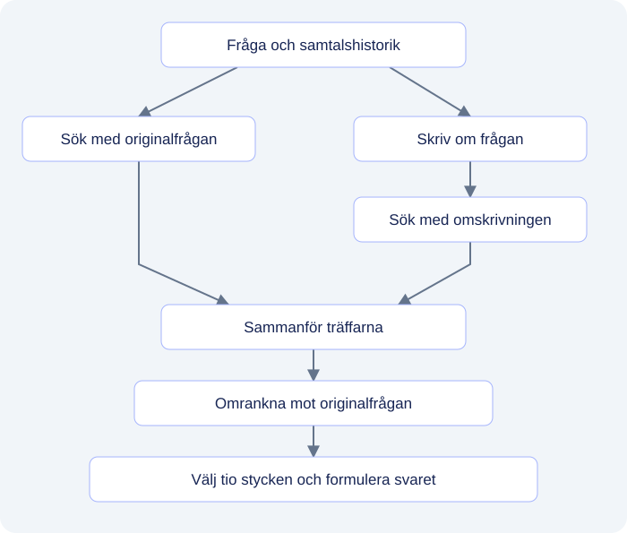

# Hur hittar en AI rätt svar i en hög med dokument?

Du vill ansöka om semester. Någonstans på intranätet finns instruktionen, men sökningen ger en blandning av gamla nyheter, personalrutiner och manualer. En sida förklarar hur du registrerar ledigheten. En annan berättar vem som godkänner den. Det borde vara en enkel fråga:

**Hur ansöker jag om semester, och vem godkänner den?**

En AI-assistent kan leta fram informationen och sammanfatta den. Men vad händer egentligen mellan frågan och svaret? Hur hittar den rätt text bland tusentals ord? Och hur vet vi att en mer avancerad lösning faktiskt fungerar bättre?

I den här artikeln, som bygger på Ed Donners kurs i LLM Engineering, följer vi hela kedjan: från enkel ordmatchning till sökning med embeddings, utvärdering och en mer avancerad RAG-lösning. Exemplen utgår från en fiktiv svensk personalhandbok. Resultaten kommer från mina körningar på labbens 150 testfrågor om det fiktiva företaget Insurellm.

De utfällbara fördjupningarna visar kod och metod. Huvudtexten går att läsa utan att öppna dem.

## Innehåll

- [Ge modellen något att läsa](#ge-modellen-något-att-läsa)
- [Första försöket: leta efter rätt ord](#första-försöket-leta-efter-rätt-ord)
- [När text blir punkter i ett rum](#när-text-blir-punkter-i-ett-rum)
- [Hur stor ska en bit kunskap vara?](#hur-stor-ska-en-bit-kunskap-vara)
- [Från sökträff till färdigt svar](#från-sökträff-till-färdigt-svar)
- [Ett bra svar är början på utvärderingen](#ett-bra-svar-är-början-på-utvärderingen)
- [Grundversionens resultat: var uppstår problemen?](#grundversionens-resultat-var-uppstår-problemen)
- [Pro-versionen: förbättra vägen till svaret](#pro-versionen-förbättra-vägen-till-svaret)
- [Resultatet: bättre totalt, men inte på allt](#resultatet-bättre-totalt-men-inte-på-allt)
- [Vad det innebär att assistenten kan dokumenten](#vad-det-innebär-att-assistenten-kan-dokumenten)
- [Kod och notebooks](#kod-och-notebooks)

---

## Ge modellen något att läsa

En språkmodell vet mycket om semester i allmänhet, men den känner inte automatiskt till vår organisations system, lokala avtal eller rutiner. Utan ett underlag kan svaret låta övertygande och ändå vara oanvändbart för den som ska skicka in sin ansökan.

Här kommer **RAG**, *Retrieval-Augmented Generation*, in. Principen är tvådelad:

1. Ett söksystem hämtar relevanta textstycken ur organisationens dokument.
2. Språkmodellen läser utdragen tillsammans med frågan och formulerar ett svar.

I vår fiktiva personalhandbok finns tre dokument:

| Dokument | Information |
| --- | --- |
| `semester.md` | Semesteransökan registreras i Personalportalen. |
| `personalportalen.md` | Välj **Ledighet → Semester**, ange datum och skicka ansökan. |
| `godkannande.md` | Närmaste chef godkänner semesteransökan. Status visas i Personalportalen. |

**Modellen tränas inte om.** Vi ger den ett tillfälligt läsunderlag när frågan ställs. Ändras en rutin uppdaterar vi dokumenten och sökindexet.

Varför inte skicka med hela handboken varje gång? För ett litet material kan det fungera bra. När mängden växer får modellen mer att läsa, kostnaden ökar och relevant information blandas med annat. Labbens 76 dokument omfattar omkring **63 500 tokens**, de textbitar modellerna arbetar med. RAG väljer ut ett mindre underlag. Därmed blir själva urvalet avgörande.

## Första försöket: leta efter rätt ord

Den första lösningen letar efter exakta ord. I ett enkelt Python-uppslag får nyckelord peka mot dokumenttext:

```python
kunskap = {
    "semester": "Semesteransökan registreras i Personalportalen.",
    "godkänner": (
        "Närmaste chef godkänner semesteransökan. "
        "Status visas i Personalportalen."
    ),
}


def hamta_kontext(fraga):
    text = "".join(c for c in fraga if c.isalpha() or c.isspace())
    ord_i_fragan = text.lower().split()
    return [kunskap[ordet] for ordet in ord_i_fragan if ordet in kunskap]
```

Frågan *”Hur ansöker jag om semester, och vem godkänner den?”* matchar nycklarna `semester` och `godkänner`. Funktionen hittar då uppgifterna om Personalportalen och närmaste chef.

Men om användaren frågar **”Hur söker jag ledigt i sommar?”** blir resultatet tomt. Orden finns inte bland nycklarna. Instruktionen om menyvalen i `personalportalen.md` saknas dessutom helt i uppslaget.

Vi behöver kunna hitta texter utifrån **betydelse och sammanhang**, även när formuleringarna skiljer sig åt.

## När text blir punkter i ett rum

En **embeddingmodell** omvandlar text till en **vektor** – en lista med tal som fungerar som koordinater i ett flerdimensionellt rum. Modellen har tränats så att texter med närliggande innebörd kan hamna nära varandra.

*”Söka ledigt i sommar”* och *”registrera en semesteransökan”* delar knappt några ord, men handlar om närliggande saker. Embeddings gör det möjligt att hitta sambandet.

När användaren ställer en fråga omvandlas även den till en vektor. Vektordatabasen **Chroma** jämför frågans vektor med de lagrade textvektorerna och hämtar närliggande stycken. Embeddingmodellen hjälper alltså till med sökningen; språkmodellen som skriver svaret kommer in senare.

I labbens första embeddingförsök delades 76 dokument upp i **413 textstycken**. Modellen `text-embedding-3-small` gav varje stycke en vektor med **1 536 dimensioner**. För att göra dem synliga använder vi **t-SNE**, som skapar en karta i tre dimensioner.


*Varje punkt är ett textstycke. Grönt visar personaldokument, blått produkter, rött avtal och orange företagsinformation. Färgerna kommer från dokumentkategorierna; placeringen beräknas ur vektorerna.*

Personaldokumenten samlas till vänster, medan produkter och avtal ligger närmare varandra på flera ställen. Det är begripligt: ett avtal kan beskriva samma produkt som produktinformationen. Kartan gör sådana mönster synliga, men dess avstånd är förenklade. **Sökningen sker i det ursprungliga vektorrummet**, inte i bilden.

<details>
<summary><strong>Teknisk fördjupning: Skapa vektorer och söka i databasen</strong></summary>

Dokumenten och frågan behöver samma embeddingmodell för att deras vektorer ska vara jämförbara. Med en redan skapad Chroma-samling kan sökningen uttryckas så här:

```python
from openai import OpenAI

client = OpenAI()
fraga = "Hur ansöker jag om semester, och vem godkänner den?"

# Skapa vektor för frågan med samma modell som indexerade dokumenten
fraga_vektor = client.embeddings.create(
    model="text-embedding-3-small",
    input=[fraga],
).data[0].embedding

# Sök fram de 5 närmaste textstyckena i Chroma
traffar = collection.query(
    query_embeddings=[fraga_vektor],
    n_results=5,
)
```

Ett modellbyte kräver normalt att dokumentens embeddings skapas på nytt. Vektorer från olika modeller är inte automatiskt jämförbara, även om de har samma antal dimensioner.

För visualiseringen används ett separat steg:

```python
from sklearn.manifold import TSNE

# Reducerar vektorerna till 3 dimensioner för att kunna ritas som en graf
punkter_3d = TSNE(n_components=3, random_state=42).fit_transform(vektorer)
```

t-SNE försöker bevara lokala grannskap. Axlarna har ingen bestämd ämnesbetydelse, och avstånd mellan grupper ska inte läsas som exakta mått på textlikhet.

</details>

## Hur stor ska en bit kunskap vara?

Varför delade vi dokumenten i hundratals stycken? En enda vektor för hela personalhandboken skulle behöva representera allt från friskvårdsbidrag till uppsägningstider. Ett kortare semesteravsnitt blir en tydligare kandidat för vår fråga.

Men för små bitar kan skilja uppgifter som hör ihop. Anta att frågan är **”Vem godkänner min semesteransökan, och var ser jag beskedet?”** och att `godkannande.md` delas så här:

| Textstycke | Innehåll |
| --- | --- |
| 1 | Närmaste chef godkänner semesteransökan. |
| 2 | Status visas i Personalportalen. |

Hämtas bara det första stycket får modellen veta vem som beslutar, men inte var beskedet syns. Behålls meningarna tillsammans följer båda uppgifterna med. Görs stycket däremot flera sidor långt blir semesterdetaljen en liten del av all text om ledighet och lön.

**Chunking handlar om balansen: tillräckligt litet för att bli en tydlig sökträff, men tillräckligt stort för att bevara sammanhanget.** Ett vanligt sätt är att dela vid naturliga brytpunkter och låta texten överlappa mellan styckena.

<details>
<summary><strong>Teknisk fördjupning: Textuppdelning och försöksinställningar</strong></summary>

Notebooken använder `RecursiveCharacterTextSplitter`, som söker brytpunkter vid bland annat styckegränser och mellanslag:

```python
from langchain_text_splitters import RecursiveCharacterTextSplitter

text_splitter = RecursiveCharacterTextSplitter(
    chunk_size=1000,  # Max 1000 tecken per stycke
    chunk_overlap=200,  # Överlapp upp till 200 tecken
)
chunks = text_splitter.split_documents(documents)
```

Storleken mäts i **tecken**, inte tokens. Överlappet minskar risken att samband bryts vid gränserna, men garanterar inte att allt sammanhang följer med.

De 413 styckena hör till `day2.ipynb` med inställningen 1 000/200. Det separata skriptet `ingest.py` använder 500/200. Notebookförsöket och skriptets inställningar ska därför hållas isär; skärmdumparna från utvärderingen redovisar inte vilken indexeringskörning som användes.

Antalet hämtade stycken spelar också roll: `answer.py` hämtar fem, medan pro-versionen väljer tio efter omrankning. Styckestorlek och antal påverkar tillsammans hur mycket text svarsmodellen får läsa.

</details>

## Från sökträff till färdigt svar

När sökningen har hittat relevanta textstycken skickas de till språkmodellen tillsammans med frågan och en instruktion. Modellen får vanlig text att läsa; vektorerna har redan gjort sitt arbete i sökningen.

| Användarens dialog | Underlag som sökningen hittade |
| --- | --- |
| **Fråga:** Hur ansöker jag om semester, och vem godkänner den?<br><br>**Svar:** Du ansöker i Personalportalen under Ledighet → Semester. Ange datum och skicka ansökan. Din närmaste chef godkänner den, och du kan följa statusen i portalen. | `semester.md`<br>Semesteransökan registreras i Personalportalen.<br><br>`personalportalen.md`<br>Välj Ledighet → Semester, ange datum och skicka ansökan.<br><br>`godkannande.md`<br>Närmaste chef godkänner semesteransökan. Status visas i Personalportalen. |

Här går varje del av svaret att följa tillbaka till ett utdrag. Frågan kräver information från **flera dokument**: var man ansöker, hur man gör och vem som godkänner. Vi kallar dem **flerkällsfrågor**, efter testkategorin *spanning*. Missas ett utdrag kan svaret bli välformulerat men ofullständigt.

Om frågan i stället är *”Hur många dagar i förväg måste jag ansöka?”* finns svaret inte i underlaget. Då bör assistenten säga det. Källhänvisningar hjälper oss att granska svaren, men vi behöver fortfarande kontrollera vad utdragen faktiskt stöder.

<details>
<summary><strong>Teknisk fördjupning: Svarsfunktionen med promptmall</strong></summary>

En förenklad svarsfunktion visar hur sökning och svar kopplas ihop. `retriever` och `llm` förutsätts vara konfigurerade:

```python
def svara(fraga):
    # 1. Hämta relevanta dokumentstycken
    dokument = retriever.invoke(fraga)

    # 2. Sammanställ texten med källangivelser
    kontext = "\n\n".join(
        f"Källa: {doc.metadata['source']}\n{doc.page_content}"
        for doc in dokument
    )

    # 3. Formulera systeminstruktionen
    instruktion = (
        "Besvara frågan enbart baserat på dokumentutdragen. "
        "Om underlaget inte räcker, säg vad som saknas.\n\n"
        f"Underlag:\n{kontext}"
    )

    # 4. Generera svaret
    svar = llm.invoke([
        {"role": "system", "content": instruktion},
        {"role": "user", "content": fraga},
    ])
    return svar.content
```

</details>

## Ett bra svar är början på utvärderingen

Ett lyckat svar visar att systemet *kan* fungera. Det säger mindre om hur ofta det fungerar eller vilka frågor det misslyckas med. För att jämföra versionerna behövs därför **fasta testfrågor med referenssvar och förväntade sökord**.

Labben innehåller **150 frågor** om direkta fakta, tid, jämförelser, siffror, relationer, information från flera källor och helheten. Utvärderingen granskar två delar av kedjan:

- **Sökkvalitet:** Hittas de förväntade uppgifterna, och hur tidigt? **MRR** belönar att nyckelorden dyker upp högt i träfflistan. **Nyckelordstäckning** visar hur stor andel som hittas över huvud taget.
- **Svarskvalitet:** En språkmodell jämför svaret med ett referenssvar och betygsätter korrekthet, fullständighet och relevans från 1 till 5. Metoden kallas **LLM-as-a-judge**.

Uppdelningen hjälper oss att skilja på en sökning som missar underlag och ett svar som inte använder underlaget väl.

<details>
<summary><strong>Teknisk fördjupning: Testfall, sökmått och svarbedömning</strong></summary>

Ett pedagogiskt testfall med semesterexemplet kan skrivas så här:

```python
testfall = {
    "question": "Hur ansöker jag om semester, och vem godkänner den?",
    "keywords": ["Personalportalen", "Semester", "närmaste chef"],
    "reference_answer": (
        "Du ansöker i Personalportalen under Ledighet → Semester. "
        "Ange datum och skicka ansökan. Din närmaste chef godkänner "
        "den, och du kan följa statusen i portalen."
    ),
    "category": "spanning",
}
```

Kodnamnen för kategorierna är `direct_fact`, `temporal`, `comparative`, `numerical`, `relationship`, `spanning` och `holistic`. Testerna är ojämnt fördelade: 70 direkta faktafrågor, 20 tidsfrågor, 20 flerkällsfrågor och tio av vardera övrig kategori.

**MRR** (*Mean Reciprocal Rank*) beräknas här per nyckelord. Första förekomsten på plats 1 ger 1/1 = 1, på plats 3 ger den 1/3 ≈ 0,33, och ett missat ord ger 0. Genomsnittet över sökorden blir frågans poäng. Sökningen sker i styckenas text, inte deras filnamn.

**nDCG** (*Normalized Discounted Cumulative Gain*) tar även hänsyn till fler träffar för varje nyckelord och ger högre vikt åt tidiga placeringar. Labbens kod jämför med bästa möjliga ordning för de stycken som faktiskt hämtades. Nyckelordens närvaro är en sökindikator, inte ett bevis på att underlaget besvarar frågan.

Svarbedömaren använder också GPT-4.1 Nano, i ett separat anrop. Den jämför med referenssvaret utan att få de hämtade utdragen. Betygen mäter därför inte källstödet direkt och ska läsas som modellbedömningar, inte procent rätt.

</details>

## Grundversionens resultat: var uppstår problemen?

Grundversionen nådde **4,05 av 5 i bedömd korrekthet** och **87,5 % nyckelordstäckning**. Men genomsnitten dolde stora skillnader mellan frågetyperna.


*Titta särskilt på spanning: både sökmåttet MRR och svarskorrektheten ligger tydligt under de enklare faktafrågorna. Staplarna visar olika frågetyper; färgerna på mätkorten följer gränssnittets valda trösklar.*

**Flerkällsfrågorna var svårast.** Där låg MRR under 0,4 och svarskorrektheten under 3 av 5. Även frågor om helheten var besvärliga. Semesterexemplet illustrerar utmaningen: det räcker inte att hitta ett stycke om rätt ämne när svaret behöver flera uppgifter.

Det väcker nästa fråga: **kan ett bättre förberett och mer genomtänkt urval ge svarsmodellen ett mer komplett underlag?**

## Pro-versionen: förbättra vägen till svaret

I pro-versionen prövar vi tre förändringar runt samma svarmodell, **GPT-4.1 Nano**:

1. **Berikade textstycken.** En språkmodell delar upp dokumenten och skapar rubrik och sammanfattning tillsammans med originaltexten. Ett stycke om godkännande får då med sig ämnet även när det läses separat. Embeddingmodellen byts till `text-embedding-3-large`.
2. **Frågeomskrivning.** Efter en fråga om semester kan användaren skriva *”Vem godkänner den?”*. Modellen använder historiken för att formulera sökfrågan *”Vem godkänner semesteransökan?”*. Vi söker med **både originalfrågan och omskrivningen**, så att vi inte förlitar oss helt på den nya formuleringen.
3. **Omrankning.** Ett utdrag om *hur man ansöker* och ett om *vem som godkänner* handlar båda om semester. Bara det senare besvarar godkännandefrågan. En språkmodell läser kandidaterna och försöker flytta upp sådana användbara utdrag. Varje sökning hämtar upp till 20 stycken; efter sammanslagning och omrankning går de tio högst rankade vidare.



*Två formuleringar breddar urvalet. Dubbletter tas bort, och kandidaterna bedöms mot originalfrågan innan svarskontexten väljs.*

Omrankningen kan förbättra ordningen, men inte hitta ett utdrag som saknas bland kandidaterna. Omskrivning och omrankning innebär också extra modellanrop, med mer tokenförbrukning och väntetid. Därför behöver förbättringen vägas mot det extra arbetet.

<details>
<summary><strong>Teknisk fördjupning: Sökflöde och strukturerad omrankning</strong></summary>

Med hjälpfunktionerna i `answer_pro.py` blir flödet:

```python
def hamta_kontext_pro(fraga, historik=None):
    # 1. Skapa en fristående fråga baserad på historiken
    omskriven = rewrite_query(fraga, historik)

    # 2. Hämta kandidater från båda formuleringarna
    originaltraffar = fetch_context_unranked(fraga)
    nya_traffar = fetch_context_unranked(omskriven)

    # 3. Slå samman och avlägsna dubbletter
    kandidater = merge_chunks(originaltraffar, nya_traffar)

    # 4. Omranka mot ursprungsfrågan och välj tio stycken
    rankade = rerank(fraga, kandidater)
    return rankade[:10]
```

För att kunna använda omrankningen i kod behöver vi en lista med ordningsnummer. **Pydantic** beskriver svarsformatet:

```python
from pydantic import BaseModel, Field


class RankOrder(BaseModel):
    order: list[int] = Field(
        description="Chunk ids ordered from most to least relevant"
    )
```

I labben anges schemat som `response_format=RankOrder` i modell-anropet via LiteLLM. Svaret läses med `RankOrder.model_validate_json(reply)`. En ordning som `[3, 1, 2]` betyder att det tredje utdraget flyttas först. Formatkontrollen gör svaret hanterbart, men garanterar inte rätt rangordning eller att alla index är giltiga.

</details>

## Resultatet: bättre totalt, men inte på allt

När pro-versionen kördes mot samma 150 testfrågor förbättrades alla sex genomsnittsmått:

| Mått | Första versionen | Pro-versionen | Förändring |
| --- | ---: | ---: | ---: |
| **MRR** (sökplacering) | 0,7796 | **0,8754** | +0,0958 |
| **nDCG** (rankningskvalitet) | 0,7892 | **0,8483** | +0,0591 |
| **Nyckelordstäckning** | 87,5 % | **94,6 %** | +7,1 procentenheter |
| **Korrekthet** | 4,05/5 | **4,54/5** | +0,49 poäng |
| **Fullständighet** | 3,93/5 | **4,23/5** | +0,30 poäng |
| **Relevans** | 4,65/5 | **4,80/5** | +0,15 poäng |


*Flerkällsfrågorna (spanning) lyfte tydligt i både sökning och svarskorrekthet. Numeriska frågor gick däremot något bakåt. Helhetsfrågorna (holistic) förbättrades men är fortfarande svårare än många direkta faktafrågor.*

Pro-versionens tydligaste framsteg gällde **flerkällsfrågorna**, precis den typ av utmaning vi följt genom semesterexemplet. Men **numeriska frågor försämrades**. För att förstå varför behöver jag följa just de fallen: hämtades rätt sifferunderlag, behölls det efter omrankningen och användes det rätt i svaret?

Förbättringen gäller den **samlade pro-versionen**. Dokumentbearbetning, embeddingmodell, sökning, instruktioner och mängden kontext ändrades tillsammans. För att veta vad varje del bidrog med behöver förändringarna testas var för sig.

## Vad det innebär att assistenten kan dokumenten

Semesterfrågan såg enkel ut. Ändå behövde assistenten hitta rätt instruktion, få med menyvalen och koppla ihop dem med vem som godkänner. Ett enda missat utdrag kunde ge ett svar som lät färdigt men bara löste halva uppgiften.

Det jag framför allt tar med mig från labben är hur mycket som händer **innan svaret skrivs**. Samma svarmodell gav bättre resultat när underlaget förbereddes och valdes ut på ett annat sätt. Samtidigt visade sifferfrågorna varför ett bättre genomsnitt inte räcker för att bedöma hela lösningen.

Nästa gång en dokumentassistent ger mig ett snyggt svar vill jag därför också titta på vad den hittade. Fanns alla uppgifter där – eller fick jag bara den del av svaret som var lättast att söka fram?

---

## Kod och notebooks

- [Del 1 – Enkel textsökning](labbar/day1.ipynb)
- [Del 2 – Dokument, embeddings och visualisering](labbar/day2.ipynb)
- [Del 3 – Koppla sökning till svarsgenerering](labbar/day3.ipynb)
- [Del 4 – Utvärdering](labbar/day4.ipynb)
- [Del 5 – Avancerad RAG](labbar/day5.ipynb)
- [Grundversionens dokumentinläsning](labbar/ingest.py) och [svarsfunktion](labbar/answer.py)
- [Pro-versionens dokumentbearbetning](labbar/ingest_pro.py) och [sökning och svar](labbar/answer_pro.py)
- [Utvärderingslogik](labbar/eval.py) och [testfrågornas struktur](labbar/test.py)

Filerna är kursbaserade labbkopior; artikelns svenska kodexempel är förenklade förklaringar. Kunskapsbanken och `tests.jsonl` ingår inte i paketet och behövs för att köra om utvärderingen. Kodfilerna behöver också placeras enligt kursens modulstruktur vid körning.

**Bakgrund:** [Ed Donners LLM Engineering, vecka 5](https://github.com/ed-donner/llm_engineering/tree/main/week5).
